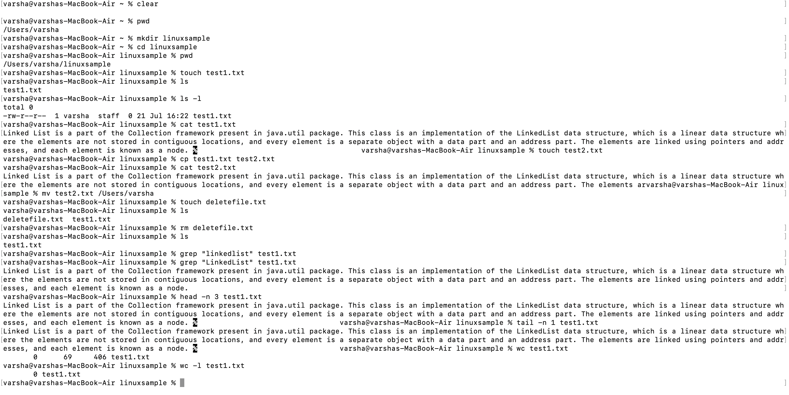
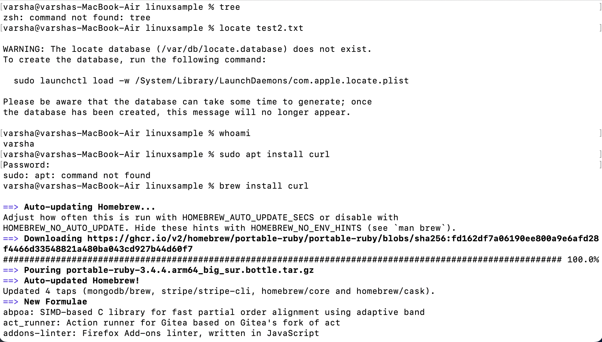
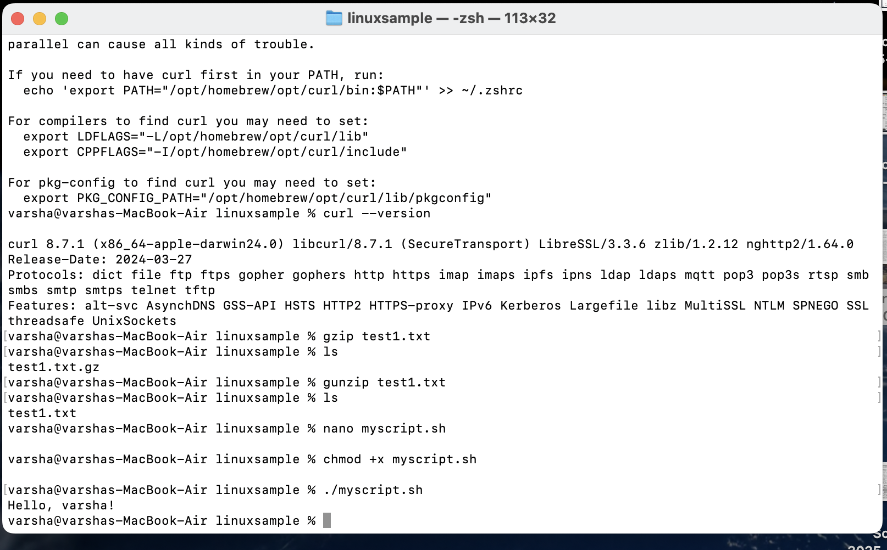

---

## 📸 Screenshots-(Linux)

### 📂Screenshot-1

  

###  Screenshot-2

  

### Screenshot-3

  

---
## 📸 Screenshots-(React)

### 📂Screenshot-1

  

###  Screenshot-2

  

### Screenshot-3

  

### Link (React Assignment)

  

---

